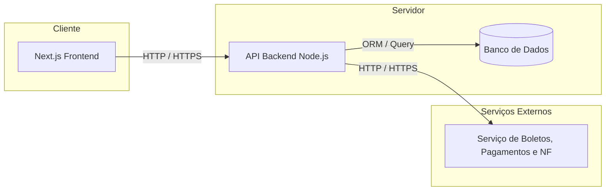

# 📘 Documento de Arquitetura do Sistema

> Este documento descreve a arquitetura proposta para o sistema, detalhando a visão geral dos componentes, modelo de dados, estrutura do frontend e definição da API.

---

## 1. 🧩 Diagrama da Arquitetura

Abaixo está o diagrama representando os principais componentes do sistema e como eles se comunicam.



> **Descrição:**  
> O sistema é composto por um frontend em Next.js, uma API backend que centraliza a lógica de negócio e o acesso ao banco de dados, e serviços externos.  
> A comunicação entre as camadas ocorre via HTTPS no padrão REST, utilizando autenticação Baerer Token.
---

## 2. 🗃️ Modelo de Dados

### 2.1. Tipo de Banco de Dados
- **Escolha:** PostgreSQL  
- **Justificativa:**  
  O PostgreSQL foi escolhido por sua robustez, suporte a relacionamentos complexos, integridade transacional e compatibilidade com ORMs modernos.

### 2.2. Esquema de Dados (SQL)
```sql
-- Usuários
CREATE TABLE usuarios (
    id SERIAL PRIMARY KEY,
    nome VARCHAR(120) NOT NULL,
    email VARCHAR(150) UNIQUE NOT NULL,
    senha_hash TEXT NOT NULL,
    role VARCHAR(20) NOT NULL, -- opções: 'ADMIN', 'MEMBRO'
    ativo CHAR(1) DEFAULT 'S', -- opções: 'S', 'N'
    criado_em TIMESTAMP DEFAULT NOW()
);

-- Intenção de participação
CREATE TABLE intencoes_participacao (
    id SERIAL PRIMARY KEY,
    nome VARCHAR(120) NOT NULL,
    email VARCHAR(150) NOT NULL,
    empresa VARCHAR(150) NOT NULL,
    mensagem TEXT,
    status VARCHAR(20) DEFAULT 'PENDENTE', -- opções: 'PENDENTE', 'APROVADA', 'RECUSADA'
    criado_em TIMESTAMP DEFAULT NOW(),
    id_usuario_aprov INT REFERENCES usuarios(id),
    id_usuario_gerado INT REFERENCES usuarios(id)
);

-- Convites de registro
CREATE TABLE convites (
    id SERIAL PRIMARY KEY,
    id_intencao INT REFERENCES intencoes_participacao(id),
    token VARCHAR(255) UNIQUE NOT NULL,
    usado BOOLEAN DEFAULT FALSE,
    criado_em TIMESTAMP DEFAULT NOW(),
    expiracao TIMESTAMP DEFAULT (NOW() + INTERVAL '7 days')
);

-- Avisos
CREATE TABLE avisos (
    id SERIAL PRIMARY KEY,
    titulo VARCHAR(150) NOT NULL,
    conteudo TEXT NOT NULL,
    id_usuario_criador INT REFERENCES usuarios(id),
    criado_em TIMESTAMP DEFAULT NOW(),
    ativo CHAR(1) DEFAULT 'S' -- opções: 'S', 'N'
);

-- Reuniões
CREATE TABLE reunioes (
    id SERIAL PRIMARY KEY,
    titulo VARCHAR(150) NOT NULL,
    descricao TEXT,
    data_hora TIMESTAMP NOT NULL,
    criado_em TIMESTAMP DEFAULT NOW(),
    ativo CHAR(1) DEFAULT 'S' -- opções: 'S', 'N'
);

-- Controle de presença
CREATE TABLE presencas (
    id SERIAL PRIMARY KEY,
    id_reuniao INT REFERENCES reunioes(id),
    id_usuario INT REFERENCES usuarios(id),
    presente CHAR(1) DEFAULT 'N', -- opções: 'S', 'N'
    data_checkin TIMESTAMP DEFAULT NOW()
);

-- Registro de indicações
CREATE TABLE indicacoes (
    id SERIAL PRIMARY KEY,
    id_indicador INT REFERENCES usuarios(id),
    id_indicado INT REFERENCES usuarios(id),
    contato VARCHAR(150) NOT NULL,
    descricao TEXT NOT NULL,
    status VARCHAR(20) DEFAULT 'NOVA', -- opções: 'NOVA', 'EM_CONTATO', 'FECHADA', 'RECUSADA'
    criado_em TIMESTAMP DEFAULT NOW()
);

-- Registro de agradecimentos
CREATE TABLE obrigados (
    id SERIAL PRIMARY KEY,
    id_remetente INT REFERENCES usuarios(id),
    id_destinatario INT REFERENCES usuarios(id),
    descricao TEXT NOT NULL,
    criado_em TIMESTAMP DEFAULT NOW()
);

-- Registro de mensalidades
CREATE TABLE mensalidades (
    id SERIAL PRIMARY KEY,
    id_usuario INT REFERENCES usuarios(id),
    competencia CHAR(6) NOT NULL, -- Formato AAAAMM
    valor NUMERIC(15,2) NOT NULL,
    status_pagamento VARCHAR(20) DEFAULT 'PENDENTE', -- opções: 'PENDENTE', 'PAGO', 'ATRASADO', 'ISENTO'
    data_vencimento DATE NOT NULL,
    data_pagamento DATE,
    criado_em TIMESTAMP DEFAULT NOW()
);

```

---

## 3. ⚛️ Estrutura de Componentes (Frontend - Next.js)

### 3.1. Organização de Pastas
```
/web
 ├── app/
 │   ├── layout.tsx
 │   ├── page.tsx
 │   ├── membros/
 │   │   ├── page.tsx
 │   │   ├── hooks/
 │   │   ├── components/
 │   │   └── services/
 │   ├── reunioes/
 │   │   └── page.tsx
 │   ├── indicacoes/
 │   │   └── page.tsx
 │   └── financeiro/
 │       └── page.tsx
 ├── components/
 │   ├── Button.tsx
 │   ├── Card.tsx
 │   └── FormInput.tsx
 ├── lib/
 ├── types/
 └── utils/
```

### 3.2. Estratégia de Estado
- **Global:** Context API para autenticação e dados persistentes.  
- **Local:** useState e useReducer para estados locais.  
- **Server Side:** utilização de Server Components para SSR e segurança de dados sensíveis.

### 3.3. Boas Práticas
- Componentes desacoplados e reutilizáveis.  
- Hooks personalizados para lógica de negócio.  
- Organização modular por domínio.

---

## 4. 🌐 Definição da API

### 4.1. Padrão
- **Tipo:** REST  
- **Base URL:** `/api/v1`  
- **Autenticação:** JWT Bearer Token  
- **Formato de dados:** JSON  

---

### 4.2. Endpoints Principais

#### 🔐 Autenticação
| Método | Rota | Descrição |
|:--|:--|:--|
| POST | /auth/login | Autentica o usuário |
| POST | /auth/register | Cria um novo usuário (membro ou admin) |
| GET  | /auth/me | Retorna informações do usuário autenticado |
| GET  | /usuarios | Lista todos os usuários |
| PUT  | /usuarios/:id | Atualiza dados de um usuário |

**Request (login):**
```json
{
  "email": "user@example.com",
  "password": "123456"
}
```

**Response:**
```json
{
  "token": "eyJhbGciOiJIUzI1NiIsInR5cCI6IkpXVCJ9...",
  "user": {
    "id": 1,
    "nome": "Eduardo",
    "email": "user@example.com",
    "role": "ADMIN"
  }
}
```

---

#### 🙋 Intenções de Participação
| Método | Rota | Descrição |
|:--|:--|:--|
| GET | /intencoes | Lista todas as intenções (Admin) |
| POST | /intencoes | Cria uma nova intenção de participação |
| PUT | /intencoes/:id/aprovar | Aprova uma intenção (Admin) |
| PUT | /intencoes/:id/recusar | Recusa uma intenção (Admin) |

**Request (POST):**
```json
{
  "nome": "Maria Souza",
  "email": "maria@example.com",
  "empresa": "Empresa",
  "mensagem": "Gostaria de participar do grupo."
}
```

**Response:**
```json
{
  "id": 5,
  "nome": "Maria Souza",
  "email": "maria@example.com",
  "empresa": "Empresa",
  "mensagem": "Gostaria de participar do grupo.",
  "status": "PENDENTE",
  "criado_em": "2025-11-08T14:00:00Z"
}
```

---

#### 📢 Avisos (Admin)
| Método | Rota | Descrição |
|:--|:--|:--|
| GET | /avisos | Lista todos os avisos ativos |
| POST | /avisos | Cria um novo aviso |
| PUT | /avisos/:id | Atualiza o conteúdo do aviso |
| DELETE | /avisos/:id | Desativa o aviso |

**Request (POST):**
```json
{
  "titulo": "Reunião mensal",
  "conteudo": "A reunião mensal ocorrerá dia 15/11 às 19h."
}
```

**Response:**
```json
{
  "id": 12,
  "id_usuario_criador": 0,
  "titulo": "Reunião mensal",
  "conteudo": "A reunião mensal ocorrerá dia 15/11 às 19h.",
  "ativo": "S",
  "criado_em": "2025-11-08T14:00:00Z"
}
```

---

#### 📅 Reuniões
| Método | Rota | Descrição |
|:--|:--|:--|
| GET | /reunioes | Lista todas as reuniões ativas |
| POST | /reunioes | Cria uma nova reunião |
| GET | /reunioes/:id | Retorna detalhes da reunião |
| PUT | /reunioes/:id | Atualiza informações da reunião |
| DELETE | /reunioes/:id | Cancela ou desativa reunião |

**Request (POST):**
```json
{
  "titulo": "Reunião de planejamento",
  "descricao": "Discussão sobre o evento anual.",
  "data_hora": "2025-11-15T19:00:00Z"
}
```

**Response:**
```json
{
  "id": 3,
  "titulo": "Reunião de planejamento",
  "descricao": "Discussão sobre o evento anual.",
  "data_hora": "2025-11-15T19:00:00Z",
  "criado_em": "2025-11-15T19:00:00Z",
  "ativo": "S"
}
```

---

#### 👥 Presenças
| Método | Rota | Descrição |
|:--|:--|:--|
| GET | /reunioes/:id_reuniao/presencas | Lista presenças de uma reunião |
| POST | /reunioes/:id_reuniao/checkin | Registra presença do usuário autenticado |
| PUT | /reunioes/:id_reuniao/presencas/:id | Atualiza uma presença (Admin) |

**Request (POST check-in):**
```json
{
  "presente": "S"
}
```

**Response:**
```json
{
  "id": 15,
  "id_reuniao": 3,
  "presente": "S",
  "data_checkin": "2025-11-08T19:20:00Z"
}
```

---

#### 🤝 Indicações
| Método | Rota | Descrição |
|:--|:--|:--|
| GET | /indicacoes | Lista todas as indicações do usuário |
| POST | /indicacoes | Cria uma nova indicação |
| PUT | /indicacoes/:id | Atualiza uma indicação |
| DELETE | /indicacoes/:id | Remove uma indicação |

**Request (POST):**
```json
{
  "id_indicado": 4,
  "contato": "Empresa/Contato Indicado",
  "descricao": "Indicação de novo cliente para parceria."
}
```

**Response:**
```json
{
  "id": 21,
  "id_indicado": 4,
  "contato": "Empresa/Contato Indicado",
  "descricao": "Indicação de novo cliente para parceria.",
  "status": "NOVA",
  "criado_em": "2025-11-08T15:00:00Z"
}
```

---

#### 🎁 Agradecimentos (Obrigados)
| Método | Rota | Descrição |
|:--|:--|:--|
| GET | /obrigados | Lista agradecimentos enviados e recebidos |
| POST | /obrigados | Cria novo registro de agradecimento |
| DELETE | /obrigados/:id | Remove um agradecimento |

**Request (POST):**
```json
{
  "id_destinatario": 3,
  "descricao": "Obrigado pela indicação do cliente XPTO."
}
```

**Response:**
```json
{
  "id": 33,
  "id_remetente": 3,
  "id_destinatario": 3,
  "descricao": "Obrigado pela indicação do cliente XPTO.",
  "criado_em": "2025-11-08T15:00:00Z"
}
```

---

#### 💰 Mensalidades
| Método | Rota | Descrição |
|:--|:--|:--|
| GET | /mensalidades | Lista mensalidades do usuário |
| POST | /mensalidades | Cria nova mensalidade (Admin) |
| PUT | /mensalidades/:id/pagar | Marca mensalidade como paga |
| GET | /mensalidades/:id | Detalha mensalidade específica |

**Request (POST):**
```json
{
  "id_usuario": 2,
  "competencia": "202511",
  "valor": 200.00,
  "data_vencimento": "2025-11-30"
}
```

**Response:**
```json
{
  "id": 8,
  "competencia": "202511",
  "status_pagamento": "PENDENTE",
  "valor": 200.00,
  "data_vencimento": "2025-11-30",
  "criado_em": "2025-11-08T15:00:00Z"
}
```

---

### 4.3. Padrões de Resposta e Erros
- **Status Codes:**  
  - `200` – OK  
  - `201` – Criado  
  - `400` – Requisição inválida  
  - `401` – Não autorizado  
  - `403` – Proibido  
  - `404` – Não encontrado  
  - `500` – Erro interno  

**Formato de erro:**
```json
{
  "error": "Invalid credentials",
  "code": 401
}
```

---

### 4.4. Convenções
- Campos booleanos são representados como `'S'` (Sim) e `'N'` (Não).  
- Campos DATE seguem o padrão **ISO 8601 (UTC)**.  
- Todas as rotas sob `/api/v1` exigem autenticação JWT, exceto `/auth/login`.  

---

## 5. 📦 Considerações Finais
> Este documento serve como base para implementação e evolução da aplicação.  
> Mudanças futuras devem manter coerência com esta arquitetura.

---

**Autor:** Eduardo Radieske  
**Data:** 08/11/2025